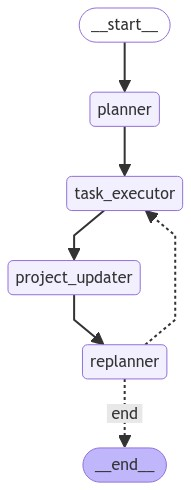

### Personal AI Task Assistant


The **Personal AI Task Assistant** is an interactive AI tool designed to assist with task automation, project management, and decision-making. This assistant leverages natural language processing to understand user inputs, execute tasks with integrated tools, and provide detailed updates and visualizations of progress.



## Key Features

The project operates through a workflow consisting of the following key nodes:

1. **Planner Node**:
   - Analyzes user inputs to develop a step-by-step plan for task execution.
   - Breaks down complex tasks into manageable steps, determining the most efficient path forward.

2. **Task Executor Node**:
   - Executes the tasks outlined in the plan using integrated tools.
   - Utilizes external APIs and systems, such as sending emails, scheduling events, or performing web searches.

3. **Project Updater Node**:
   - Provides a summary of completed tasks, highlighting progress made.
   - Includes a checklist of completed and pending tasks to maintain an overview of the project's status.

4. **Replanner Node**:
   - Evaluates the current progress and determines if the plan needs to be adjusted.
   - Replans tasks as necessary to ensure optimal task completion, accounting for any new developments or insights.

These nodes work in conjunction to manage and automate a wide variety of tasks, ensuring efficient and effective task management from start to finish.

## Task Executor Functions

The Task Executor Node relies on the following functions to perform specific operations. These functions are designed to interact with external services and APIs to carry out the necessary tasks:

### `call_calendar(query: str) -> str`
- **Purpose**: Interfaces with a calendar service (e.g., Google Calendar) to perform actions such as checking availability, scheduling meetings, and managing events.
- **Arguments**:
  - `query` (str): A string describing the calendar operation. Example: `"action=check_availability, date=next Tuesday, time=2:00 PM, duration=1 hour"`
- **Returns**: A confirmation message indicating the result of the calendar operation.

### `get_contact(name: str) -> str`
- **Purpose**: Retrieves contact information for a specified name.
- **Arguments**:
  - `name` (str): The name of the contact. Example: `"John Doe"`
- **Returns**: A string with the contact's details, typically including an email address and phone number. Example: `"Contact info for John Doe: email@example.com, 123-456-7890"`

### `send_email(to: str, subject: str, body: str) -> str`
- **Purpose**: Sends an email to a specified recipient with a subject and message body.
- **Arguments**:
  - `to` (str): The email address of the recipient. Example: `"recipient@example.com"`
  - `subject` (str): The subject of the email. Example: `"Meeting Confirmation"`
  - `body` (str): The body of the email. Example: `"Dear John, Please find attached the agenda for the upcoming meeting."`
- **Returns**: A confirmation message indicating that the email has been sent. Example: `"Email sent to recipient@example.com with subject: Meeting Confirmation"`

### `web_search(query: str) -> str`
- **Purpose**: Performs a web search based on the provided query string.
- **Arguments**:
  - `query` (str): The search query. Example: `"latest trends in AI development"`
- **Returns**: A summary of the search results. Example: `"Web search results for: latest trends in AI development"`

## Installation

1. Clone this repository:
    ```bash
    git clone https://github.com/yourusername/personal-ai-task-assistant
    cd personal-ai-task-assistant
    ```

2. Install the required packages:
    ```bash
    pip install -r requirements.txt
    ```

3. Configure your environment, including any necessary API credentials for integrated tools.

## Usage

1. Run the `app.py` file to launch the Streamlit application:
    ```bash
    streamlit run src/app.py
    ```

2. Access the Streamlit app in your web browser and select the desired AI model.

3. Enter your task or question in the input field and click "Get Assistance."

4. The assistant will generate a task plan, execute the tasks, provide updates, and allow for replanning if needed.

## Example

Input: "Please schedule a meeting with Eric for next Tuesday at 2 PM, and draft an email to send the invitation."

Output:
- The assistant schedules the meeting using the calendar tool.
- An email draft is prepared and ready to be sent.
- A project update with a checklist of completed tasks and pending actions.

## Contributing

Contributions are welcome! If you'd like to suggest improvements or add new features, please submit a pull request.

## License

This project is licensed under the [MIT License](LICENSE).

---

### Summary of Changes:
- **Task Executor Functions**: Added detailed descriptions of the functions used by the Task Executor Node to the README.
- **Updated Content**: The README now provides comprehensive information on how each function is intended to be used within the context of task execution, including argument formats and expected return values.

This README should now fully document the functionality of the Personal AI Task Assistant, including the specifics of the task execution tools.